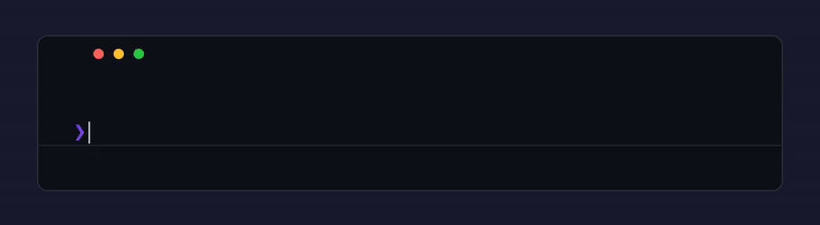

<p align="center">
  
</p>

# Manim Animation Generator (Inspired by 3B1B)

A Manim animation knowledge base for AI coding tools. Clone this repo, run the setup, and ask your AI to generate 3Blue1Brown-style explainer videos.

## Pre-Requisites

1. Docker Engine
2. Nvidia Container Toolkit

## Quickstart

```bash
git clone git@github.com:sushanthj/3B1B_animation_skills.git
cd 3B1B_animation_skills
```

```bash
./launch.sh
```

Open the repo in **Claude Code**, **Cursor**, **Windsurf**, or **GitHub Copilot**, then ask:

<p align="center">
  
</p>

<p align="center">
  
</p>

When you're done, stop the container and clean up:

```bash
./stop.sh
```

## You Can Also Provide Context

- **From slides** — give the agent a path to a `.pptx` file or paste slide content:
  > *"Animate the key ideas from `lecture.pptx`"*

- **From images** — attach a screenshot, diagram, or whiteboard photo:
  > *"Turn this diagram into a Manim animation"*

- **From a paper** — paste an abstract or link a PDF:
  > *"Explain the attention mechanism from this paper visually"*

The agent extracts the content and uses the skill knowledge to generate animations.

## Output Structure

Each animation is saved to its own folder under `animations/`:

```
animations/
  animation_backpropagation_explainer/
    scene.py          # Manim source code
    video/            # Rendered video output
    images/           # Reference images (if any)
```

The folder name is auto-generated from your prompt (e.g. `animation_circle_to_square`, `animation_fourier_series_intro`).

## License

MIT
